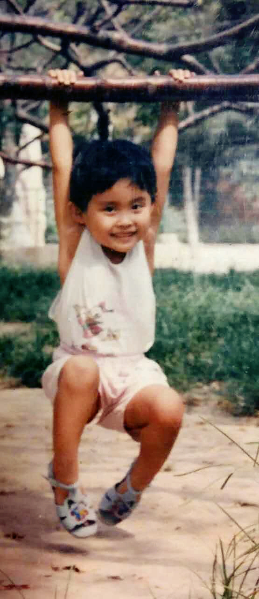
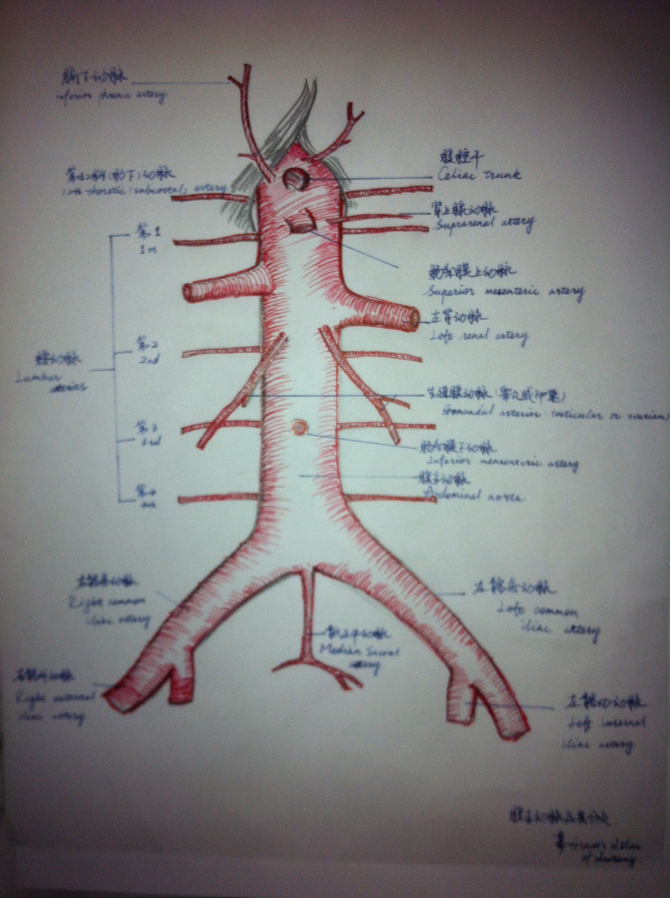

- __Name:__ Tricia Zhai
- __Ocupation:__ "Student"
- __Hobbies:__ Binge conflicting medical research news to avoid actually doing homework. 


### About this site

This started as a homework project in [p8105 data science](p8105.com) class. [Nick's site](http://nickstrayer.me/RMarkdown_Sites_tutorial/) helped me a lot. Codes are writed in Rmardown and Rstudio version is : 1.1.456 .

### Me as a human
as a kid:\



as a runner:\


## What I did before
My note:\



My rat femoral AV fistula: \


## What I do now
```{r plan_coming_week}
library(tidyverse)
today = Sys.Date()
week = c(0:6) + today
week_end = c("go to park", "do home work", "gym", "group study", "go to a musical","dinner party", "meal prep")
week_day = c("do home work", "gym", "group study", "go to lecture")


to_do = function(x)
  {
  if (weekdays(x) %in% c("Saturday", "Sunday"))
    {
   sample(week_end, 2)
    #stop("weekend, yay!")
    } 
  else{
   c("go to class", sample(week_day, 2))}
  }

output = vector("tibble", length = 7)
for (i in 1:7) {
  output[[i]] = to_do(week[[i]]) 
}

knitr::kable(tibble(weekdays(week), paste(output))) 
```